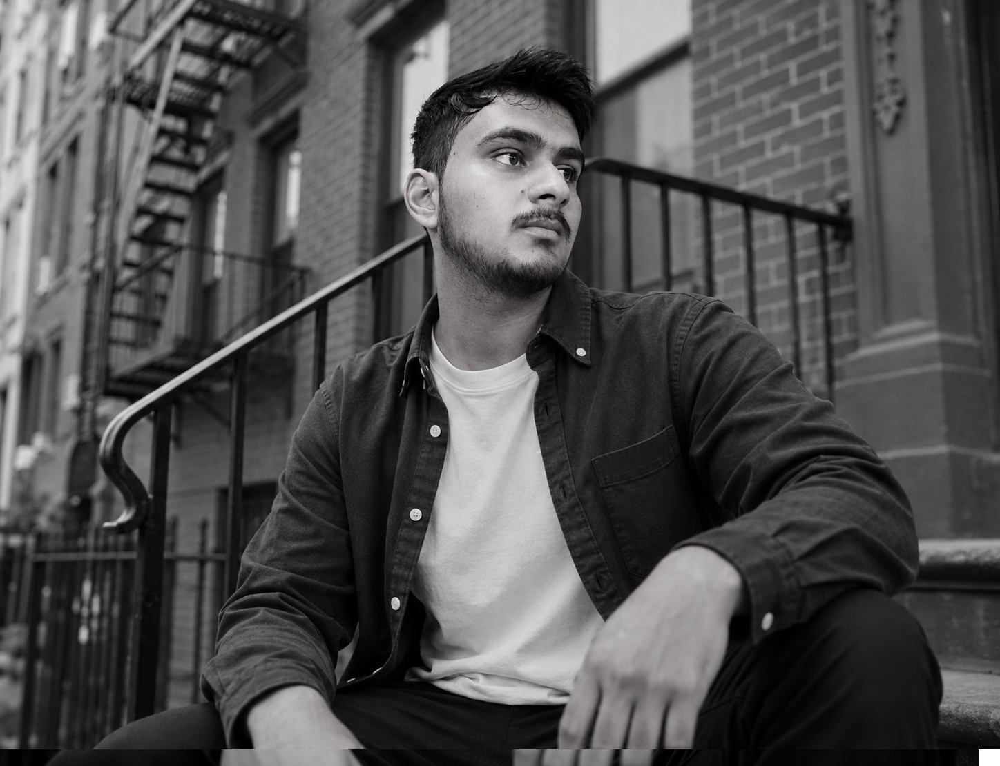

<!-- HEADER with animated wave & gradient text -->
<picture>
  <source media="(prefers-color-scheme: dark)" srcset="https://capsule-render.vercel.app/api?type=waving&color=0:2E86DE,100:9B59B6&height=200&section=header&text=IBP%20OFFICIAL&fontSize=55&fontColor=ffffff&animation=fadeIn&fontAlignY=35&desc=Web%20Developer%20%7C%20Creator%20%7C%20Learner&descAlignY=55&descSize=18&reversal=false" />
  
</picture>

<!-- Animated typing SVG with modern glow -->

<!-- Profile badges with hover effect -->
<picture>
  <source media="(prefers-color-scheme: dark)" srcset="https://komarev.com/ghpvc/?username=ibpofficial&label=Profile+Views&color=9B59B6&style=for-the-badge" />
  
</picture>
<picture>
  <source media="(prefers-color-scheme: dark)" srcset="https://img.shields.io/github/followers/ibpofficial?label=Followers&style=for-the-badge&color=2E86DE" />
  
</picture>

  

<!-- ===== ABOUT ME ===== -->
## 🧑‍💻 About Me

<table align="center" width="100%">
<tr>
<td width="60%">

- 🔭 Currently building and improving web projects  
- 🌱 Learning new tools and modern frameworks  
- 🎯 Goal: write clean, useful, and creative code  
- ⚡ Fun fact: I enjoy turning simple ideas into working projects  
- 📫 Reach me at: **ishantpbupadhyay@gmail.com**

</td>
<td width="40%" align="center">

</td>
</tr>
</table>

---

<!-- ===== TECH STACK ===== -->
## 🛠️ Tech Stack

<picture>
  <source media="(prefers-color-scheme: dark)" srcset="https://skillicons.dev/icons?i=html,css,js,git,github,vscode,figma&theme=dark" />
  
</picture>

---

<!-- ===== GITHUB STATS ===== -->
## 📊 GitHub Analytics

<table align="center" width="100%">
<tr>
<td width="50%" align="center">
  <picture>
    <source media="(prefers-color-scheme: dark)" srcset="https://github-readme-stats.vercel.app/api?username=ibpofficial&show_icons=true&theme=radical&hide_border=true&count_private=true&bg_color=0d1117&title_color=c4b5fd&icon_color=9B59B6" />
    
  </picture>
</td>
<td width="50%" align="center">
  <picture>
    <source media="(prefers-color-scheme: dark)" srcset="https://github-readme-streak-stats.herokuapp.com/?user=ibpofficial&theme=radical&hide_border=true&background=0d1117&stroke=2E86DE&ring=9B59B6&fire=9B59B6&currStreakLabel=c4b5fd" />
    
  </picture>
</td>
</tr>
</table>

  <picture>
    <source media="(prefers-color-scheme: dark)" srcset="https://github-readme-stats.vercel.app/api/top-langs/?username=ibpofficial&layout=compact&theme=radical&hide_border=true&bg_color=0d1117&title_color=c4b5fd" />
    
  </picture>

---

<!-- ===== TROPHIES ===== -->
## 🏆 GitHub Trophies

  <picture>
    <source media="(prefers-color-scheme: dark)" srcset="https://github-profile-trophy.vercel.app/?username=ibpofficial&theme=radical&no-frame=true&row=1&column=6&margin-w=10&margin-h=10" />
    
  </picture>

---

<!-- ===== CONTRIBUTION GRAPH ===== -->
## 📈 Contribution Activity

  <picture>
    <source media="(prefers-color-scheme: dark)" srcset="https://github-readme-activity-graph.vercel.app/graph?username=ibpofficial&theme=redical-red&hide_border=true&bg_color=0d1117&color=c4b5fd&line=9B59B6&point=2E86DE" />
    
  </picture>

---

<!-- ===== SOCIAL LINKS ===== -->
## 🌐 Connect With Me

  
  
  
  

 

<!-- ===== FOOTER ===== -->
<picture>
  <source media="(prefers-color-scheme: dark)" srcset="https://capsule-render.vercel.app/api?type=waving&color=0:9B59B6,100:2E86DE&height=100&section=footer&reversal=false" />
  
</picture>

<i>⭐ Thanks for stopping by — feel free to explore my repos!</i>

